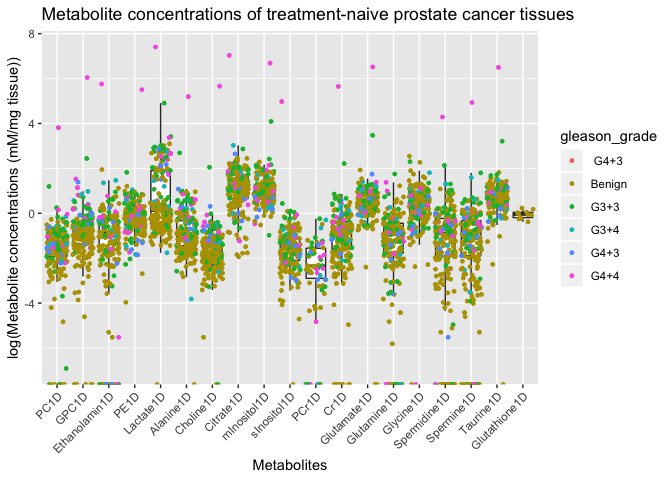
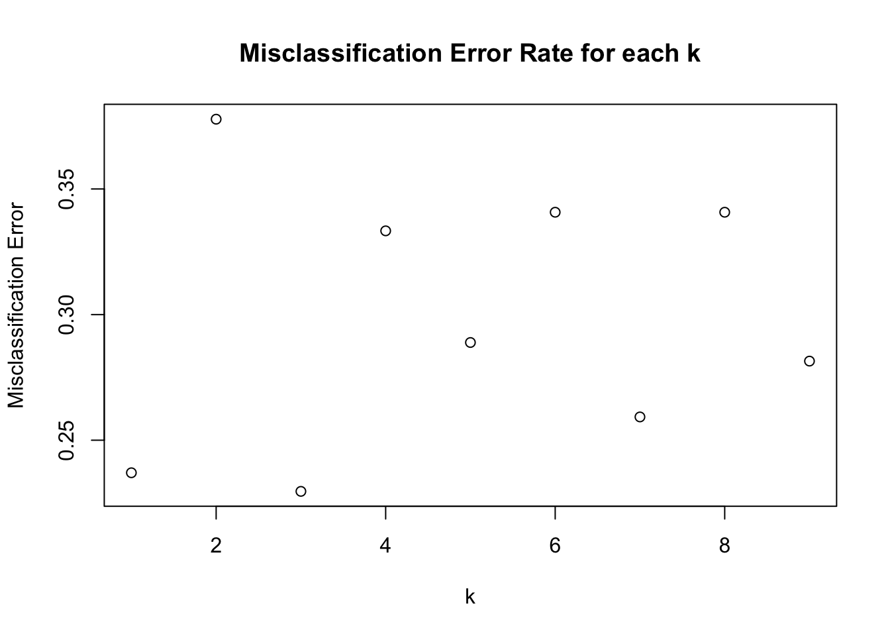
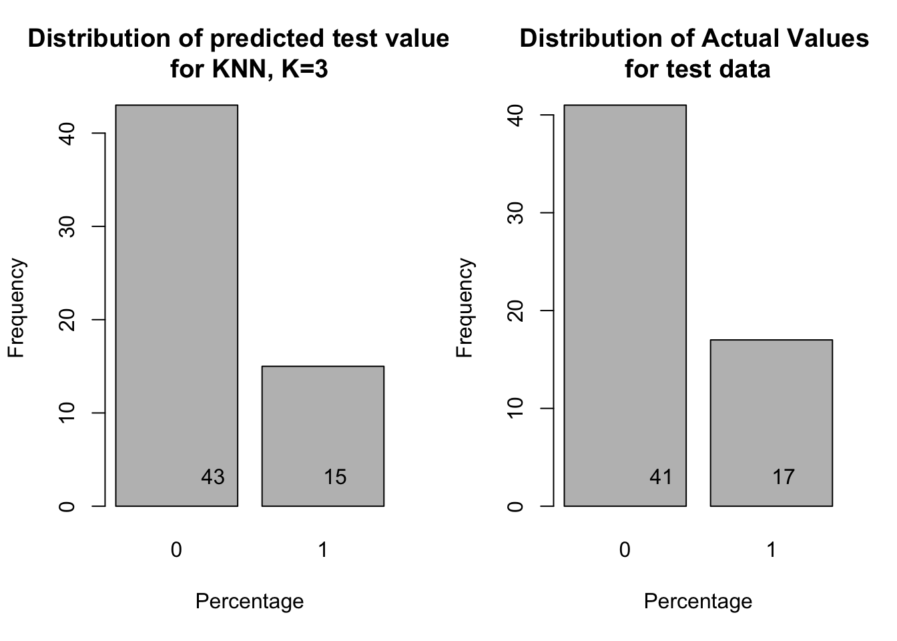

Metabolic profiling of prostate cancer biopsies using HR-MAS
================
Jinny Sun

1/29/2018

# Introduction

Prostate cancer is the most commonly diagnosed non-cutaneous cancer in
men and the second leading cause of cancer death. Due to over-diagnosis
and over-treatment of indolent low-risk disease, active surveillance
(AS) involving serial measurements of serum prostate-specific antigen
(PSA) and biopsies as well as multiparametric MRI has been implemented
in the clinic to monitor disease progression and reduce rates of
over-treatment. A pressing need in the clinical management of patients
with prostate cancer at the time of diagnosis is an accurate method for
distinguishing aggressive, potentially lethal prostate cancer from
indolent disease in individual patients in order to assess whether
active surveillance is appropriate or aggressive treatment is needed.

The goal of this analysis is to identify metabolic biomarkers of
prostate cancer using 1D 1H HR-MAS spectroscopy of fresh prostate tissue
specimen. This analysis has significant clinical impact by informing
doctors which patients should remain under active surveillance or
undergo treatment.

# Experiment Details

1D 1H CPMG spectra was acquired from fresh prostate cancer biopsies
using high-resolution magic angle spinning (HR-MAS) NMR. After the
experiment, biopsies were formalin-fixed and paraffin embedded for
pathologic analysis. Experimental methods can be found in the following
publications:

Swanson, Mark G., et al. “Proton HR‐MAS spectroscopy and quantitative
pathologic analysis of MRI/3D‐MRSI‐targeted postsurgical prostate
tissues.” Magnetic Resonance in Medicine: An Official Journal of the
International Society for Magnetic Resonance in Medicine 50.5 (2003):
944-954. [Pubmed](https://www.ncbi.nlm.nih.gov/pubmed/14587005)

Tessem, May-Britt et al. “Evaluation of lactate and alanine as metabolic
biomarkers of prostate cancer using 1H HR-MAS spectroscopy of biopsy
tissues.” Magnetic resonance in medicine vol. 60,3 (2008): 510-6.
[Pubmed](https://www.ncbi.nlm.nih.gov/pmc/articles/PMC2613807/)

# Analysis - Benign vs Cancer

For this analysis, we will identify metabolic biomarkers of prostate
cancer by comparing the metabolic profile between benign and cancer in
patients that have received no treatment. The aggressiveness of prostate
cancer is determined by a Gleason grade, which grades the primary and
secondary lesion. The two scores are then added together to A Gleason
score. A Gleason score less than 6 is considered “benign”, 6 is
considered “low grade cancer”, 7 is considered “imtermediate grade”, and
a score of 8 and above is considered “high grade”. Clinically, patients
with a Gleason score of 6 or under should remain under active
surveillance, and patients with a Gleason score of 7 or higher should
undergo treatment.

## Load data

The data is presented in csv
format.

``` r
data = read.csv("ProstateHrmas.csv", header = T, stringsAsFactors = FALSE, fill = T)
```

## Load libraries

Load the libraries required for this analysis.

``` r
library(tidyverse)
library(reshape2)
library(RColorBrewer)
library(lattice)
library(corrplot)
library(class)
library(boot)
```

## Clean data

This dataset of consists of 287 tissue samples (biopsies, post-surgical
tissues, and primary cell culture) and 32 features, including
information on the patient history, 6 parameters pertaining to HR-MAS
spectroscopy, histopathology, and 19 metabolite concentrations. Here, we
are interested in some of the features pertaining to patient history,
histopathology, and metabolite concentrations. Features that we are not
interested in are removed using `select`. This analysis will focus on
comparing the metabolite concentrations of fresh tissue samples, namely
biopsies (BY) and post-surgical tissues (P), from patients who have not
received treatment. Use `filter` to remove cell culture (CC) tissue
samples.

``` r
dim(data)
```

    ## [1] 287  32

``` r
head(data)
```

    ##      ID treatment    treatment_type tissue_mass spin_rate exp_duration
    ## 1 BY252 Radiation Brachytherapy PPI        5.98      2250           NA
    ## 2 BY253      None      No Treatment        5.69      2250          162
    ## 3 BY259      None      No Treatment        6.44      2250           NA
    ## 4 BY260      None      No Treatment        7.40      2250          130
    ## 5 BY261      None      No Treatment        7.58      2250          145
    ## 6 BY262      None      No Treatment        7.01      2250          116
    ##   echo_time mixing_time h1_90deg_pw glandular_normal stroma_normal cancer
    ## 1       144          40        8.15              11%           88%     0%
    ## 2       144          40        7.55               8%           55%     5%
    ## 3       144          40          NA              33%           66%     0%
    ## 4       144          40          NA              35%           65%     0%
    ## 5       288          40        7.85               6%           75%    18%
    ## 6       144          40          NA               5%           85%     0%
    ##   gleason_grade  PC1D GPC1D Ethanolamin1D  PE1D Lactate1D Alanine1D
    ## 1        Benign 0.161 0.094         0.405 0.844     1.081     0.179
    ## 2          G3+3 0.848 0.172         0.697 1.299     1.434     0.793
    ## 3        Benign 0.262 0.390         0.362 1.235     0.864     0.410
    ## 4        Benign 0.176 0.241         0.445 0.753     0.546     0.263
    ## 5          G3+3 0.001 0.588         0.283 1.029    19.029     0.621
    ## 6        Benign 0.193 0.060         0.000 0.670     0.401     0.207
    ##   Choline1D Citrate1D mInositol1D sInositol1D PCr1D  Cr1D Glutamate1D
    ## 1     0.062     0.193       1.885       0.000    NA 0.638       1.198
    ## 2     0.153     0.518       3.238       0.222    NA 0.390       2.858
    ## 3     0.147     5.517       4.040       0.524    NA 0.588       2.081
    ## 4     0.219     4.039       2.527       0.325    NA 0.432       1.517
    ## 5     0.159     2.513       4.590       0.045    NA 0.290       1.973
    ## 6     0.073     0.144       2.665       0.056    NA 0.401       1.434
    ##   Glutamine1D Glycine1D Spermidine1D Spermine1D Taurine1D Glutathione1D
    ## 1       0.325     1.785        0.000      0.005     1.856            NA
    ## 2       0.731     2.993        0.000      0.000     3.244            NA
    ## 3       0.563     1.183        0.783      0.452     3.093            NA
    ## 4       0.489     0.662        0.536      0.516     2.096            NA
    ## 5       5.761     1.900        0.877      0.428     2.584            NA
    ## 6       0.347     0.815        0.000      0.000     1.653            NA

``` r
data.2 <- select(data, -(treatment_type:stroma_normal))
head(data.2)
```

    ##      ID treatment cancer gleason_grade  PC1D GPC1D Ethanolamin1D  PE1D
    ## 1 BY252 Radiation     0%        Benign 0.161 0.094         0.405 0.844
    ## 2 BY253      None     5%          G3+3 0.848 0.172         0.697 1.299
    ## 3 BY259      None     0%        Benign 0.262 0.390         0.362 1.235
    ## 4 BY260      None     0%        Benign 0.176 0.241         0.445 0.753
    ## 5 BY261      None    18%          G3+3 0.001 0.588         0.283 1.029
    ## 6 BY262      None     0%        Benign 0.193 0.060         0.000 0.670
    ##   Lactate1D Alanine1D Choline1D Citrate1D mInositol1D sInositol1D PCr1D
    ## 1     1.081     0.179     0.062     0.193       1.885       0.000    NA
    ## 2     1.434     0.793     0.153     0.518       3.238       0.222    NA
    ## 3     0.864     0.410     0.147     5.517       4.040       0.524    NA
    ## 4     0.546     0.263     0.219     4.039       2.527       0.325    NA
    ## 5    19.029     0.621     0.159     2.513       4.590       0.045    NA
    ## 6     0.401     0.207     0.073     0.144       2.665       0.056    NA
    ##    Cr1D Glutamate1D Glutamine1D Glycine1D Spermidine1D Spermine1D
    ## 1 0.638       1.198       0.325     1.785        0.000      0.005
    ## 2 0.390       2.858       0.731     2.993        0.000      0.000
    ## 3 0.588       2.081       0.563     1.183        0.783      0.452
    ## 4 0.432       1.517       0.489     0.662        0.536      0.516
    ## 5 0.290       1.973       5.761     1.900        0.877      0.428
    ## 6 0.401       1.434       0.347     0.815        0.000      0.000
    ##   Taurine1D Glutathione1D
    ## 1     1.856            NA
    ## 2     3.244            NA
    ## 3     3.093            NA
    ## 4     2.096            NA
    ## 5     2.584            NA
    ## 6     1.653            NA

``` r
data.nt <- filter (data.2, treatment == "None", !grepl("*CC",ID))
dim(data.nt)
```

    ## [1] 200  23

``` r
head(data.nt)
```

    ##      ID treatment cancer gleason_grade  PC1D GPC1D Ethanolamin1D  PE1D
    ## 1 BY253      None     5%          G3+3 0.848 0.172         0.697 1.299
    ## 2 BY259      None     0%        Benign 0.262 0.390         0.362 1.235
    ## 3 BY260      None     0%        Benign 0.176 0.241         0.445 0.753
    ## 4 BY261      None    18%          G3+3 0.001 0.588         0.283 1.029
    ## 5 BY262      None     0%        Benign 0.193 0.060         0.000 0.670
    ## 6 BY265      None     0%        Benign 0.471 0.336         0.000 1.436
    ##   Lactate1D Alanine1D Choline1D Citrate1D mInositol1D sInositol1D PCr1D
    ## 1     1.434     0.793     0.153     0.518       3.238       0.222    NA
    ## 2     0.864     0.410     0.147     5.517       4.040       0.524    NA
    ## 3     0.546     0.263     0.219     4.039       2.527       0.325    NA
    ## 4    19.029     0.621     0.159     2.513       4.590       0.045    NA
    ## 5     0.401     0.207     0.073     0.144       2.665       0.056    NA
    ## 6     1.752     0.218     0.216     1.893       3.852       0.208    NA
    ##    Cr1D Glutamate1D Glutamine1D Glycine1D Spermidine1D Spermine1D
    ## 1 0.390       2.858       0.731     2.993        0.000      0.000
    ## 2 0.588       2.081       0.563     1.183        0.783      0.452
    ## 3 0.432       1.517       0.489     0.662        0.536      0.516
    ## 4 0.290       1.973       5.761     1.900        0.877      0.428
    ## 5 0.401       1.434       0.347     0.815        0.000      0.000
    ## 6 1.003       1.895       0.250     2.799        0.186      0.056
    ##   Taurine1D Glutathione1D
    ## 1     3.244            NA
    ## 2     3.093            NA
    ## 3     2.096            NA
    ## 4     2.584            NA
    ## 5     1.653            NA
    ## 6     4.676            NA

To get an idea of the overall distribution of metabolite concentrations,
let’s plot the metabolite concentrations for all samples. To plot all of
the metabolite concentrations in one graph, we will first use `melt` to
condense the data matrix into a single column. Then, use `grep` to
select the columns related to metabolite concentrations. To visualize
the data, use `ggplot` to create a boxplot overlayed with a scatterplot
of all of the metabolite concentrations. To identify outliers, data
points are colored based on the gleason score (ie. benign vs cancer) and
labeled with individual biospy IDs.

``` r
# Melt matrix to plot using ggplot
data.nt.melt <- melt(data.nt)
```

    ## Using ID, treatment, cancer, gleason_grade as id variables

``` r
data.nt.metabolites <- data.nt.melt[grep("*1D", data.nt.melt$variable), ]

# Plot
metabolites.plot <- ggplot(data.nt.metabolites, aes (x = variable, y = log(value)))+
  geom_boxplot( , outlier.shape = NA)+
  geom_jitter(aes(color = gleason_grade), size = 1)+ 
  theme (axis.text.x = element_text(angle = 45, hjust = 1)) +
  ggtitle("Metabolite concentrations of treatment-naive prostate cancer tissues") +
  xlab("Metabolites") + 
  ylab("log(Metabolite concentrations (mM/mg tissue))")

# plot without sample labels
metabolites.plot
```

    ## Warning: Removed 487 rows containing non-finite values (stat_boxplot).

    ## Warning: Removed 349 rows containing missing values (geom_point).

<!-- -->

``` r
# plot with sample labels
metabolites.plot +
  geom_text(aes(label = ID), size = 2) 
```

    ## Warning: Removed 487 rows containing non-finite values (stat_boxplot).
    
    ## Warning: Removed 349 rows containing missing values (geom_point).

    ## Warning: Removed 349 rows containing missing values (geom_text).

<!-- -->

There are two samples, P51 and P125, that have outliers in several
different metabolites, hinting that this is due to experimental error.
We will have to remove these from the dataset before any statistical
tests are performed. The outlier samples identified in the previous
graph are removed using the following code:

``` r
data.nt.c <- filter (data.nt, !grepl("P51",ID), !grepl("P125",ID))
```

There are also several NA values throughout the dataset. A majority of
samples have NA values in Cr1D and Glutathione1D. Let’s remove these
variables using `select`. There are also a few metabolite variables with
three NA values. Let’s identify the samples with these NA values, and
remove them using `filter`. Now there are no obvious outliers.

``` r
# Count the number of NA values per column
na_count <-sapply(data.nt.c, function(y) sum(length(which(is.na(y)))))
na_count <- data.frame(na_count)
na_count
```

    ##               na_count
    ## ID                   0
    ## treatment            0
    ## cancer               0
    ## gleason_grade        0
    ## PC1D                 0
    ## GPC1D                0
    ## Ethanolamin1D        3
    ## PE1D                 0
    ## Lactate1D            0
    ## Alanine1D            3
    ## Choline1D            0
    ## Citrate1D            0
    ## mInositol1D          0
    ## sInositol1D          2
    ## PCr1D              140
    ## Cr1D                 2
    ## Glutamate1D          0
    ## Glutamine1D          3
    ## Glycine1D            0
    ## Spermidine1D         3
    ## Spermine1D           3
    ## Taurine1D            0
    ## Glutathione1D      188

``` r
# Remove columns by name using dplyr
data.nt.c <- select(data.nt.c, -PCr1D, -Glutathione1D)

# Identify samples with NA values
data.nt.c[is.na(data.nt.c$Alanine1D),]
```

    ##       ID treatment cancer gleason_grade  PC1D GPC1D Ethanolamin1D  PE1D
    ## 51 BY331      None     0%        Benign 0.306 0.272            NA 0.995
    ## 52 BY332      None     0%        Benign 0.221 0.230            NA 0.689
    ## 68 BY382      None     0%        Benign 0.302 0.160            NA 1.010
    ##    Lactate1D Alanine1D Choline1D Citrate1D mInositol1D sInositol1D  Cr1D
    ## 51     0.677        NA     0.065     2.713       2.274          NA    NA
    ## 52     0.301        NA     0.043     2.851       1.533          NA    NA
    ## 68     0.429        NA     0.033     0.172       2.296       0.198 0.604
    ##    Glutamate1D Glutamine1D Glycine1D Spermidine1D Spermine1D Taurine1D
    ## 51       1.777          NA     0.972           NA         NA     1.918
    ## 52       1.061          NA     0.601           NA         NA     1.525
    ## 68       1.098          NA     1.772           NA         NA     2.047

``` r
# Remove samples
data.nt.c <- filter (data.nt.c, !grepl("BY331",ID), !grepl("BY332",ID), !grepl("BY382",ID))

#melt matrix and select columns related to metabolite concentrations
data.nt.c.melt <- melt(data.nt.c)
```

    ## Using ID, treatment, cancer, gleason_grade as id variables

``` r
data.nt.c.metabolites <- data.nt.c.melt[grep("*1D", data.nt.c.melt$variable), ]

#plot
ggplot(data.nt.c.metabolites, aes (x = variable, y = log(value))) +
  geom_boxplot( , outlier.shape = NA) +
  geom_jitter(aes(color = gleason_grade), size = 1) +
  theme (axis.text.x = element_text(angle = 45, hjust = 1)) +
  ggtitle("Metabolite concentrations of treatment-naive prostate cancer tissues") +
  xlab("Metabolites") + 
  ylab("log(Metabolite concentrations (mM/mg tissue))")
```

    ## Warning: Removed 128 rows containing non-finite values (stat_boxplot).

<!-- -->

For this analysis, we want to compare biopsy tissues that are benign
(Gleason score \< 6) and cancerous (Gleason score ≥ 6). Let’s plot a
histogram of the samples, sorted by gleason grade, to understand the
distribution of the data.

``` r
hist <- ggplot(data.frame(data.nt.c), aes(x=gleason_grade)) +
  geom_bar()

hist + ggtitle("Histogram of Predictor Variable") +
  xlab("Benign vs. malignant prostate cancer") + ylab("Sample Size")
```

<!-- -->

The majority of samples (~70%) are benign, 17% of samples have a Gleason
grade of 3+3 and are considered “low grade” tumors that should remain
under active surveillance, and the other ~13% of samples are considered
malignant or “high grade” tumors that should undergo treatment. From the
boxplot, there are two groups labeled “G4+3”, indicating an issue with
labeling in the initial datatset. We will use `str_trim` to remove any
whitespace in `gleason_grade`. Then we will combine the benign and G3+3
samples as “benign”.

``` r
# remove whitespace
data.nt.c$gleason_grade <- str_trim(data.nt.c$gleason_grade, side = c("both"))

# combine G3+3 sample with benign samples.
data.nt.c <- data.nt.c %>% mutate (class = str_replace_all(gleason_grade, "G3\\+3", "Benign"))
data.nt.c <- data.nt.c %>% mutate (class = str_replace_all(class, "G3\\+4|G4\\+3|G4\\+4", "Cancer"))

# Covert to classification to numerical
data.nt.c$class <- as.integer(data.nt.c$gleason_grade != "Benign") # 0 = Benign; 1 = Cancer

# converting cancer variable from character to numeric
data.nt.c$cancer <- as.numeric(gsub("[\\%,]", "", data.nt.c$cancer))

# filtering for malignant tissues that have < 5% cancer
data.nt.c <- data.nt.c[!(data.nt.c$class == 1 & data.nt.c$cancer < 5),]

# plot
hist <- ggplot(data.frame(data.nt.c), aes(x=class)) +
  geom_bar() +
  geom_text(stat = 'count', aes(label = ..count..), vjust=-1)

hist + 
  ggtitle("Histogram of Predictor Variable") +
  xlab("Benign vs. malignant prostate cancer") + 
  ylab("Sample Size") +
  ylim(0, 150)
```

<!-- -->

## Statistical Analysis

### Correlation matrix

For this analysis, samples with a Gleason score ≥ 6 will be labeled as
“cancer”. First, let’s look at the correlation between the predictor
variables (metabolite concentrations) and outcome (benign
vs. malignant). The strongest predictors of tumor malignancy are:
GPC1D, Lactate 1D, Alanine 1D, and Choline 1D. The overall correlation
between predictor variables is low. However, there are some metabolites
that are strongly correlated. This is expected since many metabolites
are interconnectedor and therefore regulated by the same metabolic
pathways.

``` r
#remove nonnumerical features
data.nt.c.metabolites <- select(data.nt.c, -(ID:gleason_grade))

# make a correlation matrix for all of your predictor variables 
# tells us how predictor variables correlate with your outcome as well as how they correlate with each other and point out multicollinearity
correlation = cor(data.nt.c.metabolites)
par(mfrow = c(1,1))
barplot(correlation[18,-c(18)], main = "Correlation of predictor variables with response variable", las = 2)
```

<!-- -->

``` r
#plot correlation matrix
corrplot(correlation, type="lower", order="hclust", tl.col="black", tl.srt=45)
```

<!-- -->

### Prediction using k-Nearest Neighbors

We will perform prediction of malignancy using k-Nearest Neighbors
(k-NN). In brief, k-NN performs prediction by minimiznig the distance
between samples. This is a supervised algorithm which requires a labeled
test set. Before using kNN for prediction, the optimal number of nearest
neighbors, or “k”, will be determined using a 10-fold cross validation.
This method splits the training dataset into 10 groups of equal size.
One group is subsetted to “test” the model while the other k-1 groups
are used to “train” the model. This is then repeated 10 times. Here,
functions for cross-validation and prediction using k-NN were written
using base R.

``` r
# knn function written using base R
knnk <- function(klist,Xtrain,Ytrain,Xtest) {
  # k-nearest neighbors classification
  # 
  # klist is a list of values of k to be tested
  # Xtrain, Ytrain: the training set
  # Xtest: the test set
  # Output: a matrix of predictions for the test set (one column for each k in klist)   
  
  # Number of training and test examples
  n.train <- nrow(Xtrain)
  n.test <- nrow(Xtest)
  
  # Matrix to store predictions
  p.test <- matrix(NA, n.test, length(klist))
  
  # Vector to store the distances of a point to the training points
  dsq <- numeric(n.train)
  
  # Loop on the test instances
  for (tst in 1:n.test)
  {
    # Compute distances to training instances
    for (trn in 1:n.train)
    {
      dsq[trn] <- sqrt(sum((Xtrain[trn,] - Xtest[tst,])^2)) # Euclidean distance
    }
    
    # Sort distances from smallest to largest
    ord <- order(dsq)
    
    # Make prediction using majority vote of the k nearest neighbors
    for (ik in 1:length(klist)) {
      p.test[tst,ik] <- mean(Ytrain[ord[1:klist[ik]]])
      p.test[p.test < 0.5] <- 0 # p.test threshold can be optimized
      p.test[p.test > 0.5] <- 1 # p.test threshold can be optimized
    }
  }
  
  # Return the matrix of predictions
  invisible(p.test)
}

knnk.cv <- function(klist,Xtrain,Ytrain,nfolds) {
  # Cross-validation for kNN
  #
  # Perform nfolds-cross validation of kNN, for the values of k in klist
  
  # Number of instances
  n.train <- nrow(Xtrain)
  
  # Matrix to store predictions
  p.cv <- matrix(NA, n.train, length(klist))
  
  # Prepare the folds
  s <- split(sample(n.train),rep(1:nfolds,length=n.train))
  
  # Cross-validation
  for (i in seq(nfolds)) {
    p.cv[s[[i]],] <- knnk(klist,Xtrain[-s[[i]],], Ytrain[-s[[i]]], Xtrain[s[[i]],])
  }
  
  # Return matrix of CV predictions
  invisible(p.cv)
}
```

First, we will split our dataset into train and test sets using
`sample_frac`.

``` r
# split using dplyr
train <- data.nt.c %>% sample_frac(.70)
test  <- anti_join(data.nt.c, train, by = 'ID')

Xtrain <- select(train, contains("1D"))
Xtest <- select(test, contains("1D"))

Ytrain <- train$class
Ytest <- test$class
```

Now perform a 10-Fold Cross Validation using `kNNk.cv` on the train
dataset.

``` r
#Make predictions by kNN
klist = c(1:9) # we test all values of k
nfolds = 10 # we make 10-fold cross-validation
predicted.cv = knnk.cv(klist,Xtrain,Ytrain,nfolds)

#Compute misclassification error as a function of k
MCerror = rep(NA,ncol(predicted.cv))
for (i in 1:ncol(predicted.cv)) {
  MCerror[i] <- 1-sum(predicted.cv[,i]==Ytrain)/length(Ytrain)
}
MCerror
```

    ## [1] 0.2370370 0.3777778 0.2296296 0.3333333 0.2888889 0.3407407 0.2592593
    ## [8] 0.3407407 0.2814815

``` r
# Plot misclassification error as a function of k
plot(klist, MCerror, main="Misclassification Error Rate for each k", xlab="k", ylab="Misclassification Error")
```

<!-- -->

``` r
# Use k with lowest misclassification error
final.k = which.min(MCerror)
final.k
```

    ## [1] 3

Now let’s test our model using the test dataset.

``` r
predicted.test = knnk(final.k,Xtrain,Ytrain,Xtest)

#histogram of dist. of scores
PredValues = c(sum(predicted.test == 0), sum(predicted.test == 1))
TrueValues =c(sum(Ytest == 0), sum(Ytest == 1))

par(mfrow= c(1,2))
predicted.testfactor <- as.factor(predicted.test)
plot(predicted.testfactor, main = "Distribution of predicted test values \nfor KNN, K=3", xlab = "Percentage", ylab = "Frequency")
text(predicted.testfactor, labels = PredValues, pos = 3)
Ytestfactor <- as.factor(Ytest)
plot(Ytestfactor, main = "Distribution of Actual Values \nfor test data", xlab = "Percentage", ylab = "Frequency")
text(Ytestfactor, labels = TrueValues, pos = 3)
```

<!-- -->

Determine model performance by determining the accuracy, sensitivity,
and specificity using `confusionMatrix`.

``` r
library(caret)
```

    ## 
    ## Attaching package: 'caret'

    ## The following object is masked from 'package:purrr':
    ## 
    ##     lift

``` r
Ytest <- as.factor(Ytest)
confusionMatrix(predicted.testfactor, Ytest, positive='1')
```

    ## Confusion Matrix and Statistics
    ## 
    ##           Reference
    ## Prediction  0  1
    ##          0 33 10
    ##          1  8  7
    ##                                           
    ##                Accuracy : 0.6897          
    ##                  95% CI : (0.5546, 0.8046)
    ##     No Information Rate : 0.7069          
    ##     P-Value [Acc > NIR] : 0.6731          
    ##                                           
    ##                   Kappa : 0.2244          
    ##                                           
    ##  Mcnemar's Test P-Value : 0.8137          
    ##                                           
    ##             Sensitivity : 0.4118          
    ##             Specificity : 0.8049          
    ##          Pos Pred Value : 0.4667          
    ##          Neg Pred Value : 0.7674          
    ##              Prevalence : 0.2931          
    ##          Detection Rate : 0.1207          
    ##    Detection Prevalence : 0.2586          
    ##       Balanced Accuracy : 0.6083          
    ##                                           
    ##        'Positive' Class : 1               
    ## 
